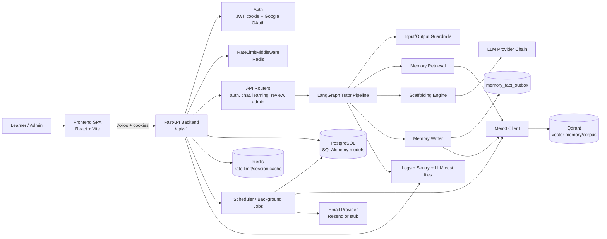
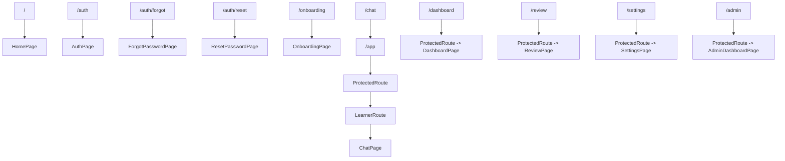
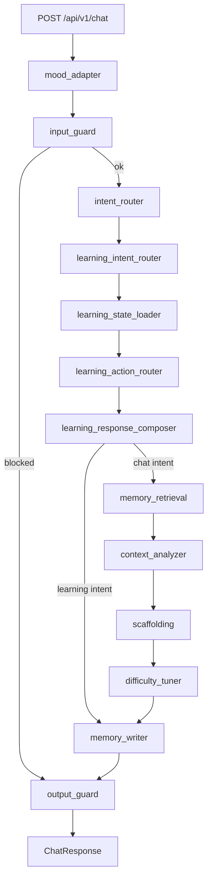
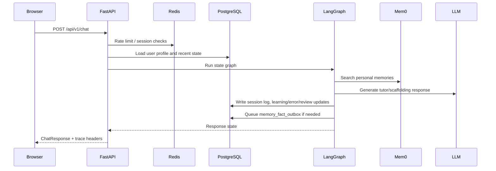
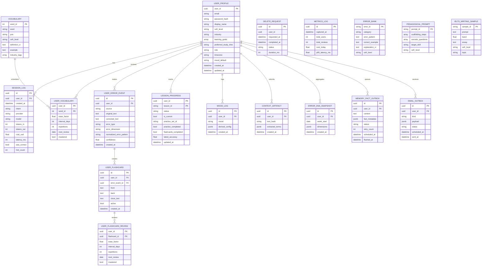
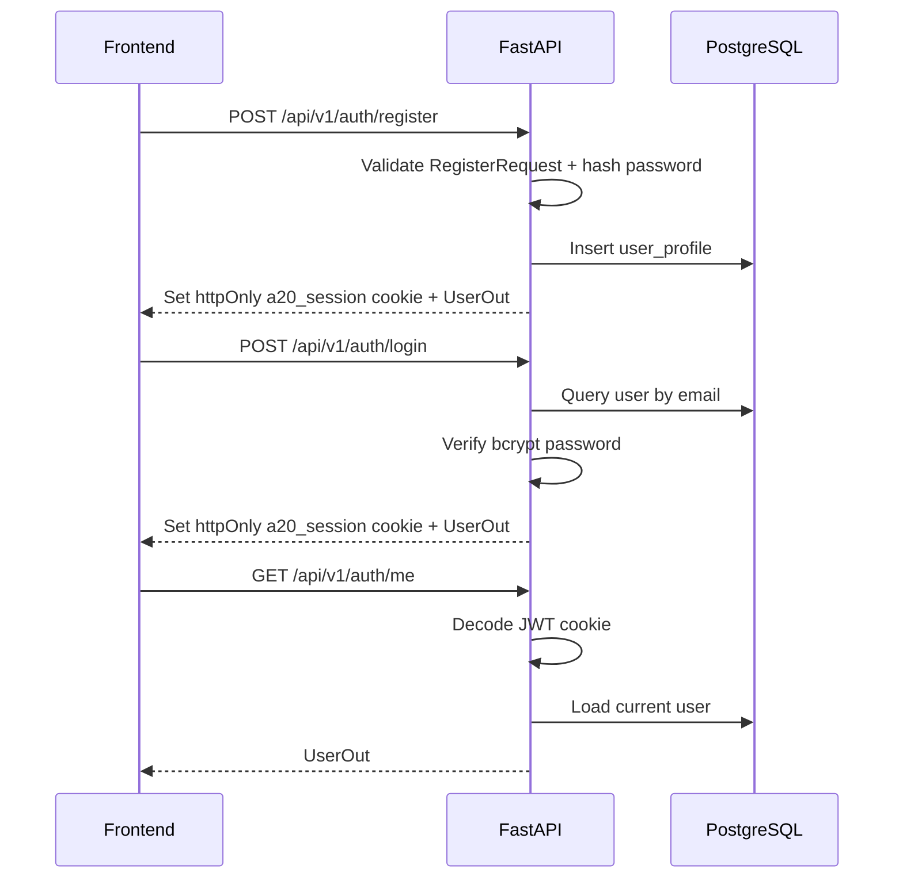
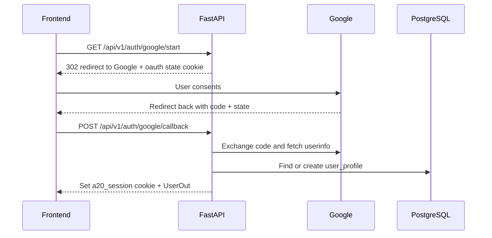
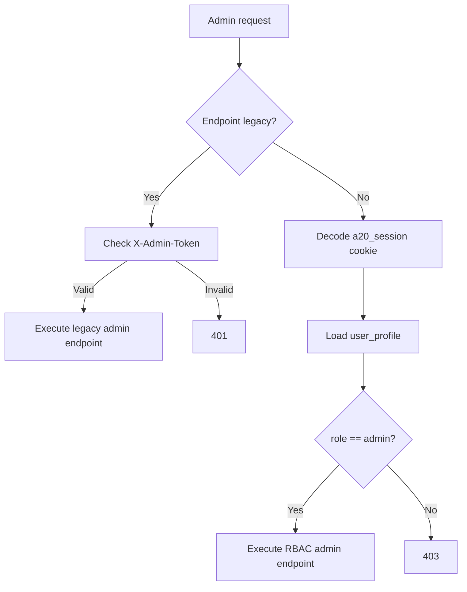
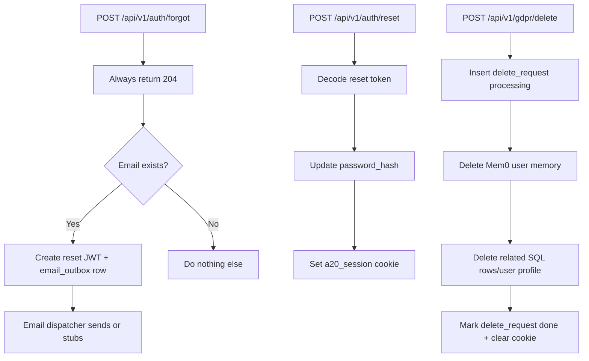

# Kiến trúc hệ thống hiện tại - Agentic Language Tutor

## 1. Phạm vi hiện tại

Hệ thống hiện tại là web app học tiếng Anh có frontend React/Vite, backend FastAPI, PostgreSQL, Redis, Qdrant/Mem0 và LangGraph tutor pipeline. Code đã có nhiều phần của kiến trúc mục tiêu: auth cookie JWT, Google OAuth, onboarding, chat, learning flow, SM-2 review, mood, context injection, Morning Brief, Error DNA, GDPR delete, admin dashboard, memory outbox, scheduler và observability.

## 2. Tech stack hiện tại

| Tầng | Công nghệ trong repo | Vai trò hiện tại |
|---|---|---|
| Frontend | React 18, Vite 5, TailwindCSS, React Router, Zustand, Axios, Recharts | SPA cho home, auth, onboarding, chat/app, dashboard, review, settings, admin |
| Backend API | FastAPI, Pydantic 2, SQLAlchemy 2, Alembic | REST API dưới `/api/v1`, validation, ORM, migrations |
| AI orchestration | LangGraph | Điều phối tutor pipeline trong `services/langgraph_orchestrator.py` |
| LLM providers | Gemini, Groq, OpenAI/Anthropic config, mock fallback | Sinh phản hồi, scaffolding, câu hỏi luyện tập, embedding/memory tùy cấu hình |
| Memory layer | Mem0 client + Qdrant | Long-term semantic memory, corpus retrieval, memory outbox flush |
| Database | PostgreSQL 16 | User profile, auth, session logs, review schedule, lessons, analytics, admin/audit |
| Cache / rate limit | Redis 7 | Rate limit, session/cache ngắn hạn |
| Scheduler | APScheduler | Metrics loop, brief/email/DNA/memory jobs tùy cấu hình |
| Observability | Structured logging, Sentry optional, LLM JSONL cost logs | Trace id, latency header, error reporting, token/cost tracking |
| Local infra | Docker Compose | backend, frontend, postgres, redis, qdrant, pgadmin |
| Deploy config | Railway backend config, Vercel frontend config | Có file cấu hình, không xác nhận trạng thái deploy thực tế |

## 3. System architecture hiện tại

### 3.1 Component diagram

### 3.2 Frontend routes hiện tại

### 3.3 LangGraph chat pipeline hiện tại

Pipeline hiện tại đã rộng hơn 4-node pipeline trong PRD. Nó bao gồm mood, guardrail, learning-flow routing, memory retrieval, context analysis, scaffolding, difficulty tuning và memory writer.

### 3.4 Runtime data flow

## 4. Database schema hiện tại

Các bảng dưới đây được xác định từ `src/backend/app/models/*.py` và Alembic migrations. PostgreSQL là source of truth cho dữ liệu định danh, học tập, lịch ôn, logs và audit. Mem0/Qdrant là memory/vector layer bên ngoài schema quan hệ.

### 4.1 ER diagram rút gọn

### 4.2 Bảng dữ liệu theo nhóm chức năng

| Nhóm | Bảng chính | Trạng thái trong code |
|---|---|---|
| User/Auth/RBAC | `user_profile` | Có email, password hash, role, timezone, onboarding fields |
| Chat/observability | `session_log`, `metrics_log` | Có token/cost/latency/hint_count và snapshot metrics |
| Vocabulary SM-2 | `vocabulary`, `user_vocabulary` | Có schedule SM-2 cho từ vựng |
| Error review SM-2 | `user_error_event`, `user_flashcard`, `user_flashcard_review` | Có lỗi cá nhân và flashcard sửa lỗi |
| Lesson flow | `lesson_progress` | Có state lesson/practice/flashcard hiện tại |
| Personalization | `mood_log`, `context_artifact`, `error_dna_snapshot` | Có mood, pasted-context artifacts, DNA snapshots |
| Memory sync | `memory_fact_outbox` | Có queue ghi facts sang Mem0 |
| Admin/email/audit | `email_outbox`, `delete_request` | Có outbox email/reset/digest và GDPR audit |
| Seeded corpus | `error_bank`, `pedagogical_prompt`, `ielts_writing_sample` | Có dữ liệu phục vụ scaffolding/corpus/practice |

## 5. Auth flow hiện tại

### 5.1 Email/password session

### 5.2 Google OAuth

### 5.3 Admin authorization

Hiện tại có 2 cơ chế admin cùng tồn tại:

- Legacy ops endpoints dùng header `X-Admin-Token`: `/api/v1/admin/metrics`, `/api/v1/admin/llm-costs`, `/api/v1/admin/users`.
- Dashboard/admin UI dùng cookie JWT + `require_admin`, kiểm `user_profile.role == "admin"`.

### 5.4 Forgot/reset password và GDPR delete

## 6. API spec hiện tại

Tất cả endpoint dưới đây có prefix `/api/v1`. Các path được lấy từ router FastAPI và frontend API client.

### 6.1 Auth, OAuth, onboarding, user

| Method | Endpoint | Auth | Mô tả |
|---|---|---|---|
| POST | `/auth/register` | Public | Đăng ký email/password kèm onboarding fields |
| POST | `/auth/login` | Public | Đăng nhập và set cookie |
| POST | `/auth/logout` | Public/User | Xóa cookie |
| GET | `/auth/me` | User | Lấy user hiện tại từ cookie |
| POST | `/auth/forgot` | Public | Queue reset email nếu user tồn tại |
| POST | `/auth/reset` | Reset token | Đổi mật khẩu và set cookie mới |
| GET | `/auth/google/start` | Public | Redirect sang Google OAuth |
| POST | `/auth/google/callback` | Public | Verify OAuth code/state và đăng nhập |
| POST | `/onboarding` | Public/User | Tạo/cập nhật profile onboarding |
| POST | `/onboarding/demo` | Public | Tạo demo user |
| GET | `/user/{user_id}` | User/Admin tùy route | Lấy profile |
| POST | `/user/{user_id}/preferences` | User/Admin tùy route | Cập nhật preferences |
| DELETE | `/user/{user_id}` | User/Admin tùy route | Xóa user theo route user |

### 6.2 Chat, learning, review

| Method | Endpoint | Auth | Mô tả |
|---|---|---|---|
| POST | `/chat` | User/Demo | Chạy LangGraph tutor pipeline |
| GET | `/session/restore` | User/Demo | Khôi phục session chat |
| DELETE | `/session/{user_id}` | User/Demo | Xóa session cache |
| GET | `/vocabulary/new` | User/Demo | Lấy vocabulary mới theo user/limit |
| GET | `/review/due` | User/Demo | Lấy vocab/error flashcards tới hạn |
| POST | `/review/submit` | User/Demo | Submit quality 0-5, cập nhật SM-2 |
| GET | `/learning/current` | User/Demo | Lấy lesson state hiện tại |
| POST | `/learning/start` | User/Demo | Start/resume lesson |
| POST | `/learning/{lesson_id}/questions` | User/Demo | Sinh practice set |
| POST | `/learning/{lesson_id}/questions/submit` | User/Demo | Chấm answers và cập nhật progress |
| GET | `/learning/{lesson_id}/flashcards` | User/Demo | Lấy flashcards của lesson |
| POST | `/learning/{lesson_id}/complete` | User/Demo | Hoàn thành lesson |

### 6.3 Personalization, analytics, GDPR

| Method | Endpoint | Auth | Mô tả |
|---|---|---|---|
| POST | `/mood` | User | Lưu mood và derived session config |
| GET | `/mood/today` | User | Lấy mood gần nhất trong ngày |
| POST | `/context/analyze` | User | Phân tích pasted context, extract terms/mini lesson |
| GET | `/brief/today` | User | Lấy Morning Brief hôm nay |
| POST | `/brief/submit` | User | Submit Morning Brief answers |
| GET | `/dna/{user_id}` | User/Admin | Lấy Error DNA snapshot cho user |
| GET | `/dna/all/list` | Admin | List DNA snapshots |
| GET | `/analytics/{user_id}/summary` | User/Admin | Summary tiến độ |
| GET | `/analytics/{user_id}/vocabulary` | User/Admin | Thống kê vocabulary |
| POST | `/gdpr/delete` | User | Xóa dữ liệu cá nhân |
| GET | `/gdpr/audit` | Admin | Audit delete requests |

### 6.4 Admin

| Method | Endpoint | Auth | Mô tả |
|---|---|---|---|
| GET | `/admin/metrics` | `X-Admin-Token` | Metrics legacy |
| GET | `/admin/llm-costs` | `X-Admin-Token` | Tổng hợp cost/latency từ JSONL |
| GET | `/admin/users` | `X-Admin-Token` | List users legacy |
| GET | `/admin/memory/status` | Admin cookie | Mem0/outbox health |
| POST | `/admin/memory/flush` | Admin cookie | Flush memory outbox |
| GET | `/admin/dashboard` | Admin cookie | Dashboard tổng hợp |
| GET | `/admin/dashboard/users` | Admin cookie | User-level admin dashboard |
| GET | `/admin/dashboard.csv` | Admin cookie | Export CSV |
| GET | `/admin/users/active` | Admin cookie | Active users / rate-limit alerts |
| POST | `/admin/users/{user_id}/role` | Admin cookie | Promote/demote role |

## 7. Hướng mở rộng kiến trúc

Các hướng dưới đây lấy `architecture_target.md` làm tham chiếu cho trạng thái mục tiêu. Mục tiêu là mở rộng từ nền hiện tại theo thứ tự giảm rủi ro trước, tăng năng lực sản phẩm sau.

### 7.1 Ổn định nền tảng vận hành

| Hướng mở rộng | Việc cần làm | Lý do |
|---|---|---|
| Chuẩn hóa deploy production | Xác nhận pipeline FE/BE cho Vercel/Railway hoặc nền tảng tương đương; tách cấu hình dev/prod rõ ràng | Kiến trúc mục tiêu yêu cầu deploy nhanh nhưng phải đo được uptime và lỗi |
| Hoàn thiện observability | Bật Sentry ở môi trường thật, chuẩn hóa trace id, log latency/token/cost theo request và graph node | Cần theo dõi P95 chat < 3s, memory retrieval < 1s và chi phí LLM |
| Tách worker khỏi web process khi tải tăng | Chuyển scheduler/job nặng như weekly email, DNA aggregate, memory compaction sang worker riêng | Tránh job nền làm chậm API chat |
| Dọn admin auth legacy | Thay dần `X-Admin-Token` bằng RBAC cookie/JWT cho toàn bộ admin endpoint | Giảm rủi ro vận hành và thống nhất phân quyền |

### 7.2 Mở rộng AI pipeline và memory

| Hướng mở rộng | Việc cần làm | Lý do |
|---|---|---|
| Memory compaction có kiểm soát | Áp dụng policy giảm `importance_score`, merge facts trùng, giới hạn 1,000-2,000 facts/user | Đúng mục tiêu giảm token cost và giữ retrieval nhanh |
| Retrieval-first prompt builder | Chuẩn hóa cách chọn Mem0 facts, corpus hits, recent turns và user profile trước khi gọi LLM | Tránh full-history injection và giảm context drift |
| Guardrails có telemetry | Lưu guardrail actions vào metrics/session log thay vì chỉ dựa vào log runtime | Admin dashboard cần biết prompt injection, PII redact, safety block xảy ra bao nhiêu lần |
| Đánh giá chất lượng tutor | Duy trì eval cho scaffolding, error detection, memory recall và regression chat quality | Mỗi thay đổi provider/model/prompt phải đo được ảnh hưởng sư phạm |

### 7.3 Mở rộng dữ liệu học tập và cá nhân hóa

| Hướng mở rộng | Việc cần làm | Lý do |
|---|---|---|
| Error DNA bản production | Chạy aggregation định kỳ, lưu snapshot ổn định, hiển thị xu hướng theo tuần/tháng | Biến lỗi rời rạc thành insight hành động cho learner |
| Context Injection an toàn hơn | Chỉ lưu hash/extracted terms khi có thể, scrub PII trước Mem0, giới hạn raw text | Tính năng paste tài liệu công việc có rủi ro privacy cao |
| Adaptive Difficulty có ngưỡng rõ | Persist quyết định tăng/giảm CEFR dựa trên accuracy nhiều phiên, cho phép rollback | Tránh tăng độ khó quá sớm làm giảm retention |
| Morning Brief và SM-2 hợp nhất | Dùng cùng nguồn lịch ôn cho vocabulary, error flashcards và brief questions | Tránh người học bị nhắc lại trùng hoặc sai thời điểm |

### 7.4 Mở rộng sản phẩm sau alpha

| Hướng mở rộng | Việc cần làm | Lý do |
|---|---|---|
| Weekly progress email | Kích hoạt email provider thật, template hóa digest, theo dõi sent/failed/retry | Hỗ trợ re-engagement ngoài app |
| Admin cost control | Thêm cảnh báo user vượt 50 queries/day, cost/user/day, provider fallback rate | Alpha cần kiểm soát ngân sách API |
| Native mobile hoặc PWA nâng cao | Chỉ triển khai sau khi web flow ổn định; ưu tiên offline/cache/push nếu dùng PWA | PRD để native app ngoài scope alpha |
| Voice/pronunciation và payment | Đưa vào phase sau alpha, tách khỏi core text tutor hiện tại | Đây là nhánh sản phẩm mới, không nên làm lẫn với memory/scaffolding core |

## 8. Ghi chú rủi ro hiện tại

- Có song song RBAC admin cookie và legacy `X-Admin-Token`; cần giữ rõ ranh giới hoặc dọn legacy khi ổn định.
- Memory/LLM có nhiều chế độ degraded/mock/fallback; khi đánh giá chất lượng cần ghi rõ provider và env đang dùng.
- Scheduler chạy theo cấu hình môi trường; các tính năng như weekly email, compaction, brief job có thể có code nhưng không tự chứng minh đã chạy trong prod.
- `architecture_target.md` đang là tài liệu mục tiêu/mở rộng; khi code đổi tiếp, nên cập nhật lại mục hướng mở rộng để phản ánh ưu tiên mới.
