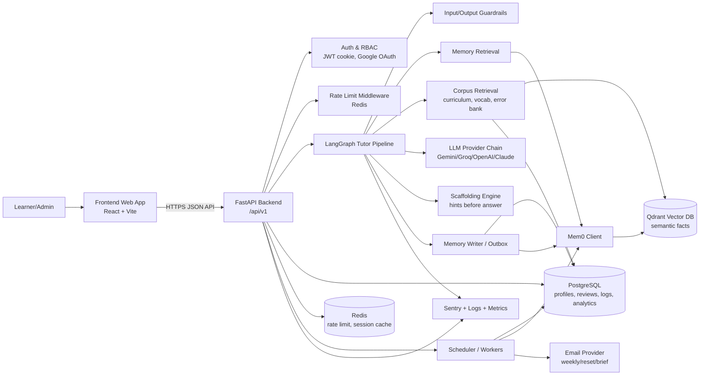
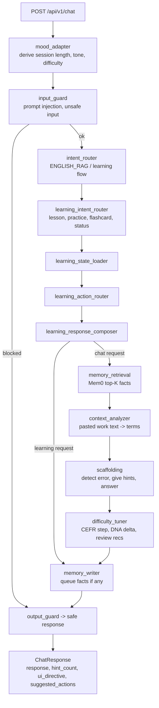
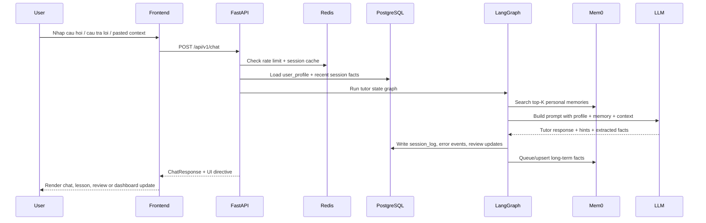
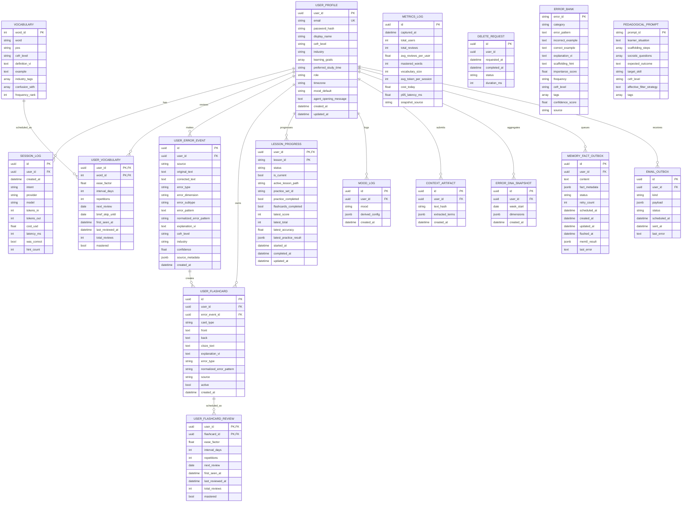
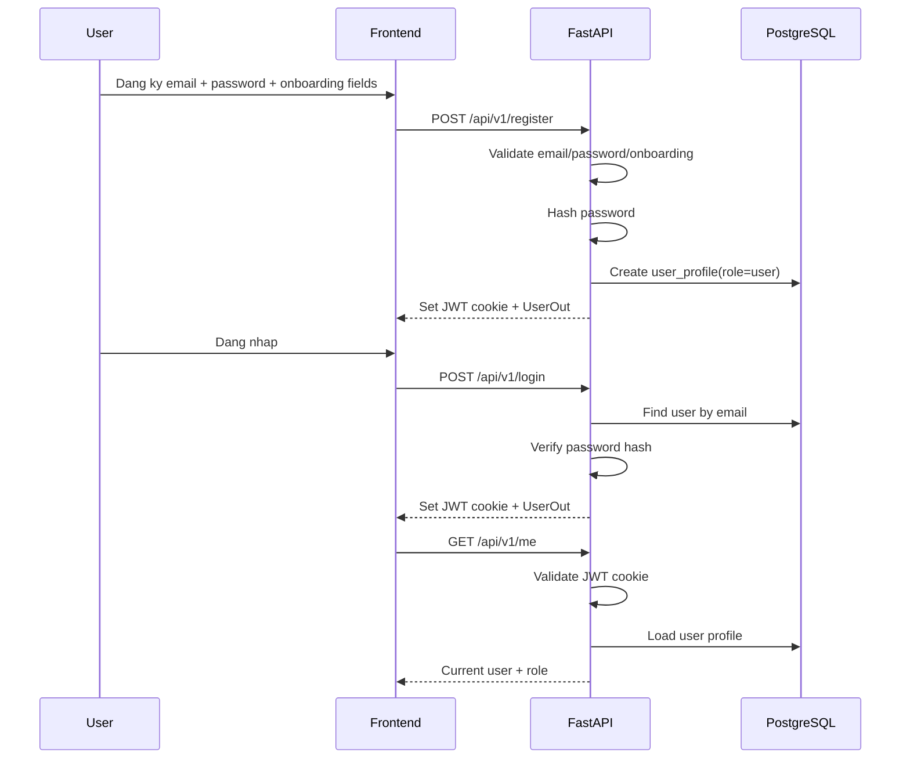
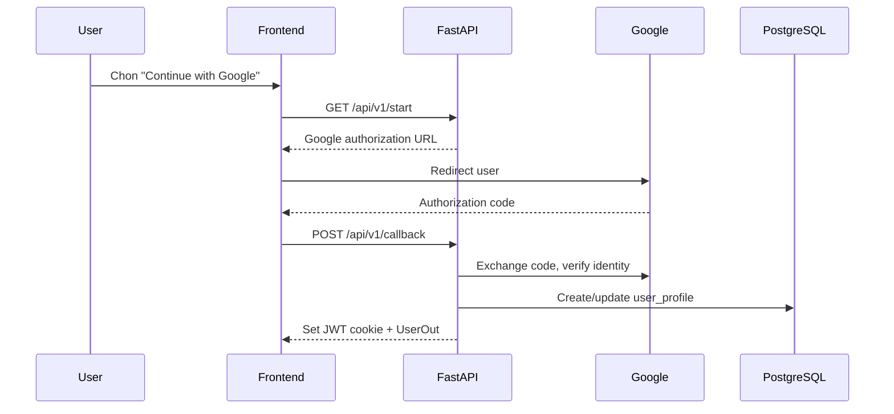
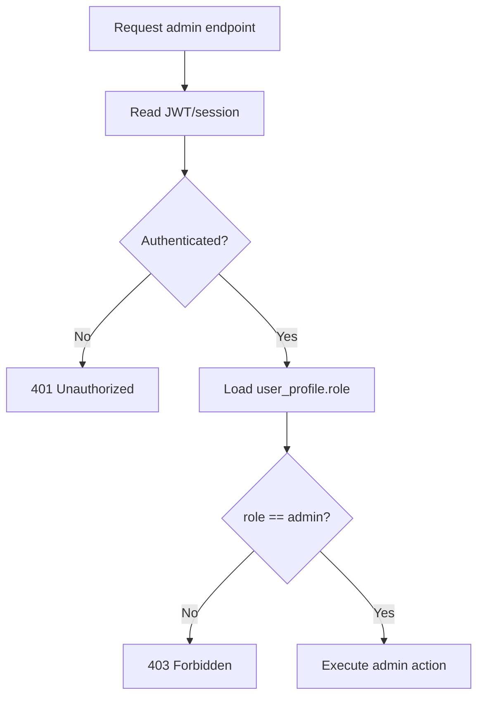
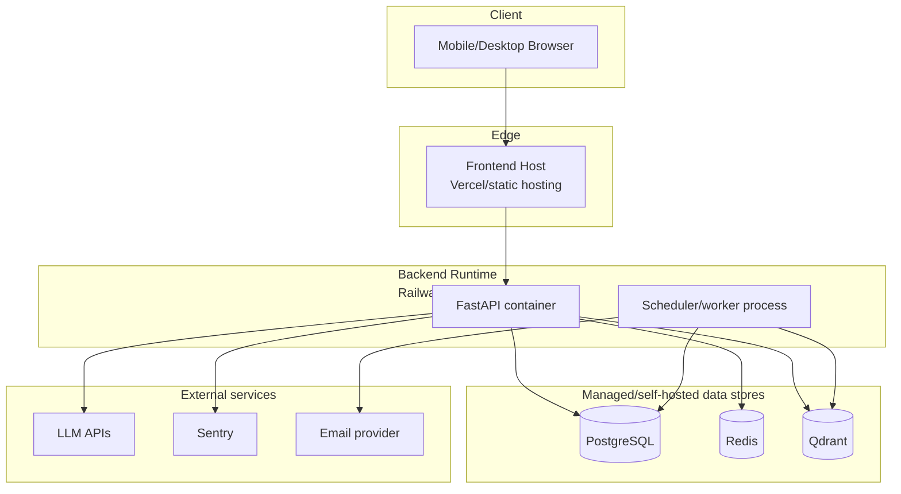

# Kien truc muc tieu he thong - Agentic Language Tutor

Tai lieu nay duoc tao dua tren `docs/project requirements/PRD_v2.md` va tuan thu yeu cau dau ra trong `docs/system architecture/requirements.md`: tech stack, system architecture diagram, database schema, auth flow va API spec don gian.

## 1. Muc tieu kien truc

Agentic Language Tutor la web app hoc ngoai ngu co tri nho dai han cho nguoi di lam ban ron. Kien truc muc tieu can giai quyet 5 yeu cau chinh:

- Duy tri persistent memory xuyen phien hoc bang Mem0/Qdrant.
- Dieu phoi luong gia su bang LangGraph thay vi chat endpoint don thuan.
- Ca nhan hoa bai hoc theo CEFR level, nganh nghe, loi sai, mood va lich su on tap.
- Ho tro micro-learning: mo app la co bai on/nghiem vu ngan, luu tien do tu dong.
- Theo doi chi phi, latency, error va xoa du lieu ca nhan theo yeu cau.

## 2. Tech stack muc tieu

| Tang | Cong nghe | Vai tro | Ghi chu |
|---|---|---|---|
| Frontend | React + Vite + TailwindCSS | Web app mobile-responsive: onboarding, chat, review, dashboard, settings | Repo hien tai dung `src/frontend` |
| Backend API | FastAPI | REST API, auth, session, rate limit, orchestration entrypoint | Repo hien tai dung `src/backend/app` |
| AI orchestration | LangGraph | Dieu phoi mood, guardrails, intent, memory, scaffolding, memory writer | Mo rong tu 4-node PRD thanh graph co guardrails va learning flow |
| LLM provider | Gemini/Groq/OpenAI/Claude fallback | Tao phan hoi, scaffolding, phan tich context, sinh cau hoi | Uu tien provider co cost/latency phu hop alpha |
| Memory layer | Mem0 + Qdrant | Semantic memory va vector search cho facts ca nhan hoa | Target 1,000-2,000 facts/user, retrieval P95 < 1s |
| Database | PostgreSQL | User profile, auth, session logs, review schedule, analytics, audit | Quan he ro, phu hop RBAC va bao cao |
| Cache/rate limit/session | Redis | Rate limit 50 queries/user/day, session restore, short-lived cache | Giam tai DB/LLM |
| Scheduler | APScheduler/background workers | Morning brief, weekly email, memory outbox flush, metrics snapshot | Co the tach worker sau alpha |
| Observability | Sentry + structured logs + metrics table | Error tracking, trace id, latency, token cost | Can co tu Sprint 1 |
| Deployment | Vercel/Static host FE + Railway/AWS/GCP BE | Deploy nhanh cho alpha | Docker Compose dung cho local/dev |

## 3. System architecture

### 3.1 Component diagram



### 3.2 Chat/AI pipeline



### 3.3 Data flow frontend-backend-AI-database



## 4. Database schema muc tieu

PostgreSQL la source of truth cho user/account, tien do hoc, lich on tap, observability va audit. Mem0/Qdrant luu semantic facts dai han; khong thay the relational DB.

### 4.1 ER diagram



### 4.2 Mem0 fact schema

Mem0 facts can duoc gan metadata de truy xuat nhanh, xoa theo user va nen memory khi vuot nguong.

```json
{
  "user_id": "uuid",
  "fact_type": "error_pattern | vocabulary | mood_pattern | industry_vocab | skill_level | topic_preference",
  "content": "User confuses 'affect' with 'effect' in marketing contexts",
  "metadata": {
    "source_session": "session_id",
    "cefr_level": "B1",
    "industry": "marketing",
    "importance_score": 0.85,
    "review_count": 3,
    "last_updated": "2026-05-15"
  }
}
```

### 4.3 Du lieu chinh theo use case

| Use case | Bang/Memory lien quan |
|---|---|
| Onboarding | `user_profile`, initial Mem0 facts |
| Chat gia su | `session_log`, `user_error_event`, `memory_fact_outbox`, Mem0 |
| Spaced repetition | `user_vocabulary`, `user_flashcard_review`, `vocabulary`, `user_flashcard` |
| Error DNA | `user_error_event`, `error_dna_snapshot`, `error_bank` |
| Mood-adaptive session | `mood_log`, Mem0 `mood_pattern` |
| Context injection | `context_artifact`, Mem0 `industry_vocab` |
| Admin cost dashboard | `session_log`, `metrics_log` |
| Delete my data | `delete_request`, cascade DB delete, Mem0 delete by user |

## 5. Auth flow va phan quyen

### 5.1 Roles

| Role | Quyen |
|---|---|
| `user` | Onboarding, chat, review, dashboard ca nhan, mood, context injection, xoa du lieu cua minh |
| `admin` | Tat ca quyen user + admin dashboard, metrics, memory status/flush, user role update, GDPR audit |

### 5.2 Email/password login



### 5.3 Google OAuth



### 5.4 Admin authorization



## 6. API spec don gian

Tat ca API chinh nam duoi prefix `/api/v1`. Response loi nen co shape chung:

```json
{
  "error": "Request failed",
  "detail": "Human-readable message",
  "trace_id": "request-trace-id"
}
```

### 6.1 Auth va user

| Method | Endpoint | Auth | Mo ta |
|---|---|---|---|
| POST | `/register` | Public | Tao user bang email/password + onboarding |
| POST | `/login` | Public | Dang nhap, set session cookie/JWT |
| POST | `/logout` | User | Xoa session cookie |
| GET | `/me` | User | Lay profile hien tai |
| POST | `/forgot` | Public | Tao reset email/outbox |
| POST | `/reset` | Public | Doi password bang reset token |
| GET | `/start` | Public | Bat dau Google OAuth |
| POST | `/callback` | Public | Google OAuth callback |
| GET | `/user/{user_id}` | User/Admin | Lay profile user |
| POST | `/user/{user_id}/preferences` | User/Admin | Cap nhat preferences |
| DELETE | `/user/{user_id}` | User/Admin | Xoa user co gioi han quyen |

### 6.2 Onboarding va learning

| Method | Endpoint | Auth | Mo ta |
|---|---|---|---|
| POST | `/onboarding` | Public/User | Tao profile onboarding 3 buoc |
| POST | `/onboarding/demo` | Public | Tao demo learner |
| GET | `/learning/current` | User | Lay lesson state hien tai |
| POST | `/learning/start` | User | Bat dau/resume lesson |
| POST | `/learning/{lesson_id}/questions` | User | Sinh cau hoi on tap |
| POST | `/learning/{lesson_id}/questions/submit` | User | Cham bai, cap nhat progress |
| GET | `/learning/{lesson_id}/flashcards` | User | Lay flashcards cua lesson |
| POST | `/learning/{lesson_id}/complete` | User | Danh dau lesson hoan thanh |

### 6.3 Tutor, memory va review

| Method | Endpoint | Auth | Mo ta |
|---|---|---|---|
| POST | `/chat` | User/Demo | Chay LangGraph tutor pipeline |
| GET | `/session/restore` | User | Khoi phuc chat/session gan nhat |
| DELETE | `/session/{user_id}` | User/Admin | Xoa session cache cua user |
| GET | `/vocabulary/new` | User | Lay tu vung moi theo profile |
| GET | `/review/due` | User | Lay vocab/error flashcards den lich SM-2 |
| POST | `/review/submit` | User | Submit quality 0-5, cap nhat SM-2 |
| GET | `/brief/today` | User | Morning brief retrieval questions |
| POST | `/brief/submit` | User | Submit cau tra loi morning brief |
| POST | `/mood` | User | Luu mood dau phien va derived config |
| GET | `/mood/today` | User | Lay mood hom nay |
| POST | `/context/analyze` | User | Phan tich pasted work text, extract terms |

### 6.4 Analytics, DNA, GDPR va admin

| Method | Endpoint | Auth | Mo ta |
|---|---|---|---|
| GET | `/analytics/{user_id}/summary` | User/Admin | Tong quan tien do ca nhan |
| GET | `/analytics/{user_id}/vocabulary` | User/Admin | Thong ke tu vung |
| GET | `/dna/{user_id}` | User/Admin | Error DNA snapshot |
| GET | `/dna/all/list` | Admin | Danh sach DNA snapshots |
| POST | `/gdpr/delete` | User | Xoa du lieu ca nhan va memory |
| GET | `/gdpr/audit` | Admin | Audit delete requests |
| GET | `/admin/metrics` | Admin | Metrics tong quan |
| GET | `/admin/llm-costs` | Admin | Chi phi LLM |
| GET | `/admin/memory/status` | Admin | Trang thai Mem0/outbox |
| POST | `/admin/memory/flush` | Admin | Flush queued memory facts |
| GET | `/admin/dashboard` | Admin | Dashboard tong hop |
| GET | `/admin/dashboard.csv` | Admin | Export CSV |
| POST | `/admin/users/{user_id}/role` | Admin | Cap nhat role user/admin |

## 7. Non-functional requirements

| Danh muc | Muc tieu |
|---|---|
| Chat latency | P95 end-to-end < 3s; P99 < 5s |
| Memory retrieval | P95 < 1s |
| Loading UI | Khong co loading chinh > 2s neu co cached/session state |
| Scale alpha | 100-200 active users; rate limit 50 queries/user/day |
| Token cost | Giam >= 80%, target 90%, bang retrieval-first thay vi full-history prompt |
| Data deletion | Hoan thanh delete request < 30s voi audit row |
| Privacy | PII scrubbing truoc khi luu Mem0; user co quyen delete memory |
| Availability | 99.5% trong giai doan alpha |
| Accessibility | Mobile responsive, WCAG AA cho cac flow chinh |
| Observability | Moi request co trace id, latency, provider/model, token/cost neu dung LLM |

## 8. Deployment view



## 9. Ranh gioi alpha va huong mo rong

### Alpha must-have

- Email/password auth, Google OAuth optional.
- Onboarding 3 buoc: CEFR, industry, learning goals.
- Chat text-based voi LangGraph, guardrails, memory retrieval, scaffolding.
- SM-2 review cho vocabulary va error flashcards.
- Mood check-in, context injection MVP.
- Admin dashboard cho cost, latency, users va memory outbox.
- GDPR delete flow.

### Sau alpha

- Native mobile app.
- Voice/pronunciation assessment.
- Payment/subscription.
- Multi-language support.
- Advanced memory compression va cohort benchmarking cho Error DNA.
