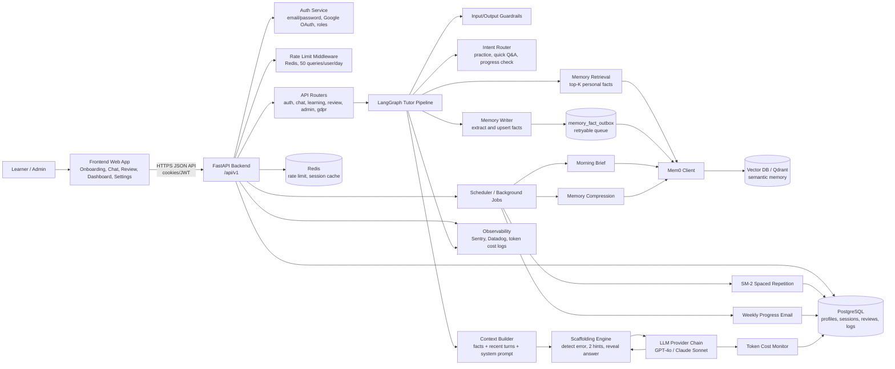
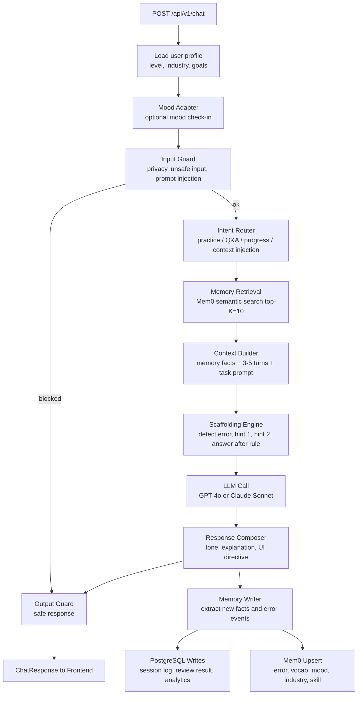
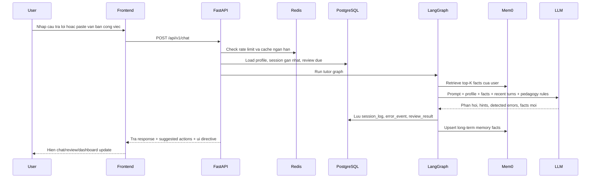
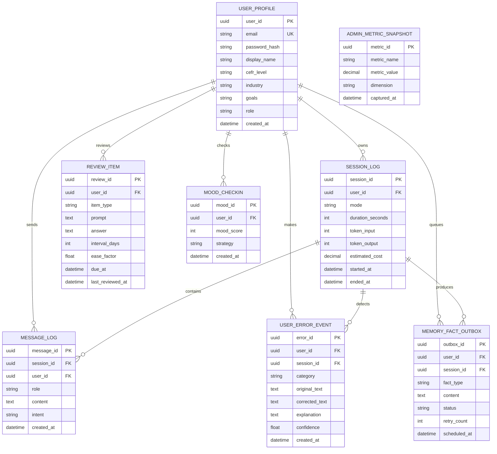

# Kien truc he thong theo PRD v2 - Agentic Language Tutor

Tai lieu nay duoc tao dua tren `docs/project requirements/PRD_v2.md`. Muc tieu la bien yeu cau san pham thanh ban thiet ke ky thuat co the doc truc tiep trong VS Code bang Markdown Preview/Mermaid.

## 1. Muc tieu kien truc

Agentic Language Tutor la web app hoc tieng Anh cho nguoi di lam ban ron, can duy tri tri nho dai han va ca nhan hoa bai hoc qua nhieu phien hoc ngan. Kien truc tap trung vao cac muc tieu:

- Ghi nho loi sai, tu vung, trinh do, nganh nghe, mood va chu de ua thich cua tung nguoi hoc.
- Dieu phoi phan hoi gia su bang LangGraph thay vi mot chatbot endpoint don gian.
- Truy xuat memory P95 duoi 1 giay va phan hoi end-to-end P95 duoi 3 giay.
- Giam chi phi token bang retrieval-first memory thay vi day toan bo lich su hoi thoai vao prompt.
- Ho tro micro-learning, spaced repetition, scaffolding va delete-my-data cho alpha.

## 2. Tech stack de xuat

| Tang | Cong nghe | Vai tro |
|---|---|---|
| Frontend | Next.js hoac React + Vite, TailwindCSS | Web app mobile-responsive: onboarding, chat, review, dashboard, settings |
| Backend API | FastAPI | REST API, auth, rate limit, session management, entrypoint cho LangGraph |
| Orchestration | LangGraph | Dieu phoi tutor pipeline: retrieval, context, scaffolding, memory writer |
| LLM Core | GPT-4o / Claude Sonnet | Hieu ngon ngu, sinh phan hoi, giai thich loi, tao hint |
| Memory Layer | Mem0 + Vector DB/Qdrant | Luu va truy xuat semantic facts dai han |
| Database | PostgreSQL | User profile, auth, session logs, review schedule, analytics |
| Cache | Redis | Rate limit, session cache, short-lived retrieval cache |
| Scheduler/Worker | Background jobs/APScheduler/Celery | SM-2 review, morning brief, weekly progress email, memory compaction |
| Monitoring | Sentry/Datadog + cost logs | Error tracking, latency, token cost per user/session |
| Infrastructure | Vercel + Railway/AWS/GCP | Deploy frontend/backend cho alpha |

## 3. Component diagram



## 4. LangGraph tutor pipeline

Pipeline alpha trong PRD gom 4 node cot loi: Memory Retrieval, Context Builder, Scaffolding Engine va Memory Writer. Ban thiet ke duoi day mo rong nhe de ho tro mood, guardrails va intent routing ma van giu dung loi kien truc PRD.



## 5. Data flow chinh



## 6. Memory fact schema

Mem0/Qdrant luu semantic facts dai han. PostgreSQL van la source of truth cho user, session, audit va bao cao.

```json
{
  "user_id": "uuid",
  "fact_type": "error_pattern | vocabulary | mood_pattern | industry_vocab | skill_level | topic_preference",
  "content": "User confuses 'affect' as a verb with 'effect' as a noun",
  "embedding": [0.01, 0.02],
  "importance_score": 0.85,
  "last_updated": "2025-04-10",
  "review_count": 3,
  "source_session": "session_id"
}
```

## 7. Database schema muc tieu



## 8. API spec alpha

| Method | Endpoint | Muc dich |
|---|---|---|
| POST | `/api/v1/auth/register` | Dang ky email/password |
| POST | `/api/v1/auth/login` | Dang nhap, set JWT cookie |
| GET | `/api/v1/auth/me` | Lay user hien tai |
| POST | `/api/v1/onboarding` | Luu level, industry, goals |
| POST | `/api/v1/chat` | Chay LangGraph tutor pipeline |
| GET | `/api/v1/review/today` | Lay bai on SM-2 hom nay |
| POST | `/api/v1/review/{review_id}/answer` | Cham ket qua on tap va cap nhat interval |
| GET | `/api/v1/dashboard/progress` | Top loi sai, accuracy trend, vocabulary stats |
| POST | `/api/v1/context-injection` | Tao mini-lesson tu van ban cong viec |
| POST | `/api/v1/mood-checkin` | Luu mood va chon chien luoc phien hoc |
| DELETE | `/api/v1/gdpr/me` | Xoa memory va du lieu ca nhan theo yeu cau |
| GET | `/api/v1/admin/metrics` | Token cost, latency, query count, active users |
| GET | `/api/v1/admin/export.csv` | Export CSV bao cao alpha |

## 9. Non-functional requirements mapping

| Yeu cau PRD | Thiet ke dap ung |
|---|---|
| End-to-end response P95 < 3s | Redis cache, Mem0 top-K retrieval, prompt ngan, provider fallback |
| Memory retrieval P95 < 1s | Vector DB index, top-K=10, cache query lap lai |
| Token cost giam 80-90% | Retrieval-first context, khong inject full conversation history |
| Delete memory < 30s | GDPR endpoint xoa PostgreSQL user data + Mem0 facts theo user_id |
| 100-200 concurrent users alpha | FastAPI async, Redis rate limit, DB index, background outbox |
| Privacy | PII scrubbing truoc khi ghi Mem0, audit log cho delete/export |
| Observability | Trace id, Sentry, latency metrics, token cost per session |

## 10. Alpha delivery plan theo PRD

| Sprint | Kien truc can hoan thanh |
|---|---|
| Sprint 1 | Infra, auth, onboarding, PostgreSQL schema, Redis rate limit, Mem0 connection, admin cost metrics |
| Sprint 2 | LangGraph 4-node pipeline, scaffolding engine, chat UI, SM-2 review, mood check-in |
| Sprint 3 | Progress dashboard, memory compression, context injection MVP, alpha monitoring, bug fix |

## 11. Ranh gioi du lieu

- PostgreSQL luu du lieu dinh danh, lich su phien hoc, analytics, review schedule va audit.
- Mem0/Qdrant luu semantic facts ca nhan hoa co the truy xuat bang vector search.
- Redis chi luu du lieu ngan han: rate limit, session cache, retrieval cache.
- LLM provider khong phai source of truth; moi output quan trong phai duoc parse, scrub PII va luu co cau truc.

## 12. VS Code usage

Mo file nay trong VS Code va nhan `Ctrl + Shift + V` de xem Mermaid Preview. Neu VS Code chua render Mermaid, cai extension `Markdown Preview Mermaid Support`.
